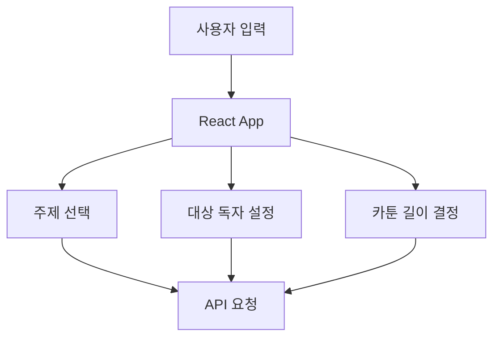
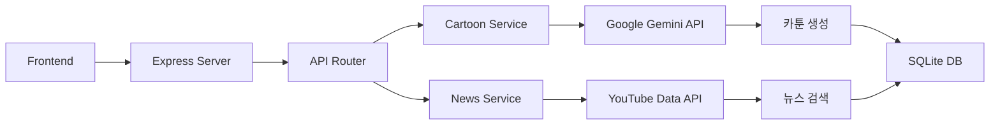
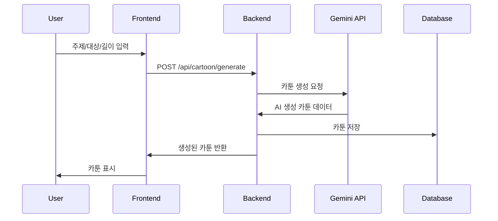
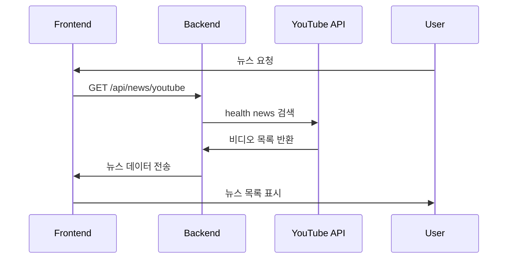

# Digital Health Cartoon 🏥🎨

AI 기반 교육용 건강 카툰 생성 서비스

## 📋 서비스 소개

Digital Health Cartoon는 최신 의료 뉴스와 AI 기술을 결합하여 누구나 쉽게 이해할 수 있는 교육용 카툰을 생성하는 서비스입니다.

### 주요 기능
- 🎯 **AI 카툰 생성**: Google Gemini API를 활용한 주제별 교육 카툰 제작
- 📺 **의료 뉴스 통합**: YouTube Data API로 최신 건강/의료 뉴스 제공
- 🗄️ **데이터베이스**: SQLite로 생성된 카툰 저장 및 관리
- 🌐 **반응형 웹**: React + TypeScript로 구현된 현대적 UI

## 🏗️ 작동 원리

### 1. 프론트엔드 (React)


**사용 기술:**
- **React 19**: 컴포넌트 기반 UI 개발
- **TypeScript**: 타입 안전성 확보
- **Vite**: 빠른 개발 환경
- **Tailwind CSS**: 스타일링 프레임워크

### 2. 백엔드 (Node.js + Express)


**핵심 컴포넌트:**
- **Express 서버**: API 엔드포인트 관리
- **CartoonService**: AI 카툰 생성 로직
- **NewsService**: 유튜브 뉴스 데이터 처리
- **DatabaseService**: SQLite 데이터베이스 관리

### 3. AI 카툰 생성 프로세스


### 4. 뉴스 통합 프로세스


## 🗂️ 프로젝트 구조

```
digital-health-cartoon/
├── backend/                 # Node.js 백엔드
│   ├── src/
│   │   ├── routes/         # API 라우트
│   │   ├── services/       # 비즈니스 로직
│   │   └── index.ts        # 서버 시작점
│   ├── package.json
│   └── .env.example        # 환경변수 예시
├── frontend/               # React 프론트엔드
│   ├── src/
│   │   ├── components/     # React 컴포넌트
│   │   ├── App.tsx         # 메인 앱
│   │   └── main.tsx        # 진입점
│   ├── dist/               # 빌드 결과물
│   └── package.json
└── cloudflare-worker/      # Cloudflare 배포용
    ├── src/index.js        # Workers 스크립트
    └── wrangler.toml       # 배포 설정
```

## 🚀 배포 방식

### Cloudflare Pages (프론트엔드)
- **정적 사이트 호스팅**: 빌드된 React 앱 배포
- **CDN**: 전 세계 빠른 접속 속도
- **자동 HTTPS**: 보안 연결 기본 제공

### Cloudflare Workers (백엔드)
- **서버리스**: 인프라 관리 불필요
- **전역 실행**: 엣지 위치에서 API 실행
- **무료 티어**: 월 100,000 요청까지 무료

## 🛠️ 개발 환경 설정

### 1. 로컬 개발
```bash
# 백엔드 실행
cd backend
npm install
npm run dev

# 프론트엔드 실행
cd frontend
npm install
npm run dev
```

### 2. 환경변수 설정
```bash
# backend/.env
GEMINI_API_KEY=your_gemini_api_key
YOUTUBE_API_KEY=your_youtube_api_key
PORT=3001
```

## 📚 핵심 개념 설명

### API 연동 방식
1. **RESTful API**: HTTP 메소드를 활용한 자원 관리
2. **CORS 처리**: 프론트엔드-백엔드 통신 보안
3. **에러 핸들링**: API 응답 예외 처리

### 데이터베이스 설계
```sql
-- 카툰 정보 테이블
CREATE TABLE cartoons (
  id TEXT PRIMARY KEY,
  title TEXT NOT NULL,
  summary TEXT,
  created_at DATETIME,
  sources TEXT
);

-- 카툰 장면 테이블
CREATE TABLE cartoon_scenes (
  id INTEGER PRIMARY KEY,
  cartoon_id TEXT,
  scene_number INTEGER,
  description TEXT,
  image_prompt TEXT,
  image_url TEXT,
  dialogue TEXT,
  FOREIGN KEY (cartoon_id) REFERENCES cartoons(id)
);
```

### AI 프롬프트 엔지니어링
```javascript
const prompt = `Create a ${length}-scene educational cartoon about ${topic} for ${audience}. 
Include:
1. Clear scene descriptions
2. Natural dialogue
3. Educational value
4. Appropriate complexity level`;
```

## 🔧 주요 라이브러리

### Backend
- **express**: 웹 프레임워크
- **sqlite3**: 데이터베이스
- **axios**: HTTP 클라이언트
- **typescript**: 타입스크립트

### Frontend
- **react**: UI 라이브러리
- **vite**: 빌드 도구
- **tailwindcss**: CSS 프레임워크

## 🌐 배포 상태

**현재 배포 주소**: https://mosi-second-job.pages.dev

⚠️ **현재 상태**: 웹사이트 접속 불가
원인: Cloudflare Pages에 프론트엔드가 올바르게 배포되지 않음

## 🔍 문제 해결

### 배포 문제 진단
1. **빌드 확인**: `frontend/dist/` 폴더 존재 확인
2. **배포 설정**: Cloudflare Pages 빌드 명령어 확인
3. **라우팅**: `_redirects` 파일 설정 확인
4. **CORS**: API 연동 설정 확인

### 다음 단계
1. Cloudflare Pages 재배포
2. Workers API 배포
3. 도메인 연결 확인
4. 전체 서비스 테스트

---

**개발자**: Moses Song  
**기술 스택**: React, TypeScript, Node.js, Cloudflare  
**라이선스**: MIT